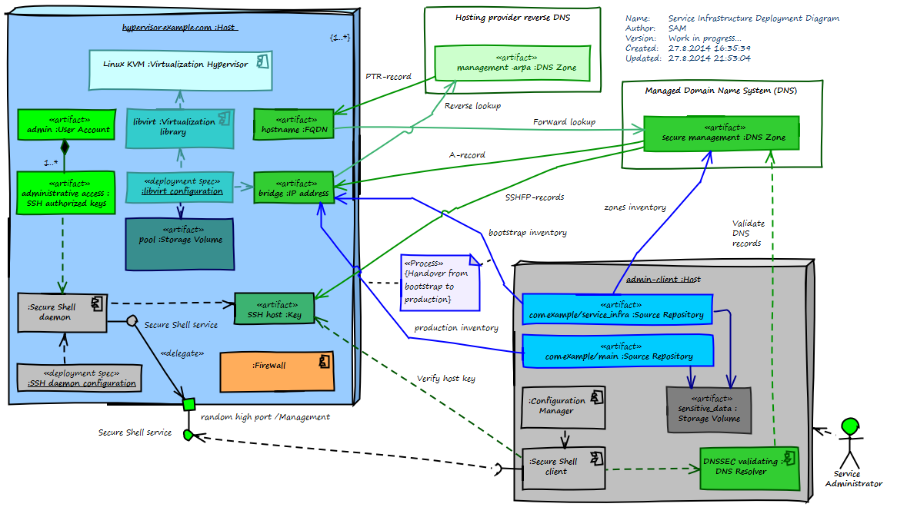

# Service Infrastructure

This is a configuration management database (CMDB)
for tracking configuration items (CIs) related to
deployment of hardware virtualization hypervisors,
their guest virtual machines, and a secure domain
name system (DNS) for administrative access during
service transition.

A hypervisor is a physical infrastructure node for
hosting the virtual machines comprising the service.

The service management domain name system provides
identification, authentication, and key management
support for the service infrastructure resources
and their secure administration.

## Current implementation

This Git repository contains Ansible playbooks for
the provision of new hardware virtualization hypervisors
configured for secure, unattended access, based on the
following external services, software applications and components:

Infrastructure service                    | Supported alternatives                                             | Budget estimate, without obligation, 2014
----------------------------------------- | ------------------------------------------------------------------ | -----------------------------------------
Hosting provider                          | [Hetzner Online](https://www.hetzner.de/en/)                       | Monthly 54 € per root server
Managed DNS provider with DNSSEC support  | [DynECT Managed DNS Express](https://dyn.com/managed-dns-express/) | Monthly 12 € for Express 5
Domain name registrar with DNSSEC support | [Dyn](https://dyn.com)                                             | Annual 19 € per domain

Infrastructure component  | Supported alternatives
------------------------- | --------------------------------------------------------
Server hardware           | Server computer with CPU hardware virtualization support
Operating System          | CentOS
Management access         | SSH
Revision Control          | Git
Configuration Management  | Ansible
Hypervisor                | Linux Kernel-based Virtual Machine (KVM)
Virtualization management | libvirt

Information source                | Reference
--------------------------------- | ----------------------
Secure Domain Name System (DNS)   | http://www.dnssec.net/

## Prerequisites

1. Competencies
    * Basic know-how of the Domain Name System (DNS)
    * Basic know-how of DNS Security Extensions (DNSSEC)
    * Intermediate know-how of Linux virtualization
1. Service Infrastructure configuration repository (this CMDB)
1. Administrative Client System (ACS) ready for use
1. Account with the hosting provider (requires credit card)
    * Hetzner Webservice API access
1. Account with the managed DNS provider (requires credit card)
    * DynECT API access
1. A domain name with DNSSEC support for management purposes
1. Main configuration repository for the service operation stage
1. Root access credentials and the IP addresses of one or more dedicated servers

### Registering a management domain name

When registering a management domain, make sure that your registrar
offers DNSSEC support for the specific TLD that you are planning to use.

Using a randomly generated name for the management domain may improve
privacy by making it more difficult to associate with the public
service instance name.

## Deployment procedure

The playbooks are run on an
[Administrative Client System (ACS)](https://github.com/sakaal/admin_client)
that has access to the service infrastructure nodes and external services
via a secure private channel over the Internet.

    git clone git@github.com:sakaal/service_infra_ansible.git

1. Examine until you understand the configuration files.
   Make working copies of the sample files as appropriate for your environment.

1. Observe instructions found in the configuration files.

1. Open the sensitive data volume:

        sudo open_sensitive_data

### Deploying the DNS zones

If you haven't already created a security enabled DNS zone:

1. Add the management DNS zone default A record IP address
   to the `zones` inventory.

1. Deploy the zone using:

        ansible-playbook -v dns.yml -i zones
1. Add the Delegation Signer (DS) record from the DNS management console
   to your domain registration.

### Obtaining the servers

* If you are deploying new servers, obtain one or more dedicated servers
  from the hosting provider to your account.
    * This may involve some of your account details
      being passed to RIPE for IP address registration.
    * Preparing the servers may take some time depending on the hosting provider.
      Some hosting providers process orders only during their office hours.
* If you are re-installing existing servers, bring them to their initial state
  according to your hosting provider's method.

Once you have the servers:

1. If you need additional public IP addresses for any of the guest
   virtual machines, allocate them with the hosting provider. 
    * You may need to specify the purpose of use according to RIPE guidelines.

1. Add the target host addresses to the `bootstrap` inventory.

1. Copy the `host_vars/203.0.113.1.sample` to a file with
   a name matching the inventory entry, and edit it to set
   at least the `dns_zone` and `hostname`:

        cd host_vars/
        cp 203.0.113.1.sample 203.0.113.1

1. Perform a minimal operating system installation using whichever approach
   is most convenient in the hosting provider's environment.
    * [Hetzner installimage CentOS](Hetzner_installimage_CentOS.md)
1. Set a strong root account password as appropriate.
   It will only be used when preparing the host for automated configuration.
   Keep the credentials according to the administrative access plan, just in case.

### Configuring the servers

1. If you are redeploying previously existed hosts,
   remove the old server keys from your known hosts file:

        ansible-playbook forget_servers.yml -i bootstrap
    * You may need to contact the hosts manually once, to accept their new host keys.

1. Prepare the hosts for automated configuration:

        ansible-playbook managed_servers.yml -ki bootstrap
    * You may need to provide the root password manually on the initial run.
    * You may need to accept the target host key fingerprint at first connect.

1. Configure the hosts as virtualization hypervisors:

        ansible-playbook hypervisors.yml -i bootstrap

The hypervisors are now ready to be transferred to service operation.

### Provisioning guest virtual machines

1. Replace the `[libvirt_guests_host.example.com]` group in the
   `bootstrap` inventory by substituting your hypervisor hostnames for
   `host.example.com`. Create one group per hypervisor.

1. Add the guest virtual machine fully qualified domain names (FQDNs) to the
   `bootstrap` inventory under the guests group of the desired hypervisor.
    * These are local private guest names in the secure management domain
      for administrative access via the hypervisor.

1. For each guest, copy the `host_vars/guest.host.example.com.sample`
   to a file with a name matching the guest FQDN, and
   edit the file to set the guest provisioning parameters:

        cd host_vars/
        cp guest.host.example.com.sample guest.host.example.com

1. Provision the guest virtual machines:

        ansible-playbook guests.yml -i bootstrap

The guests are now ready to be transferred to service operation.

### Transfer to service operation

The hypervisors and their guest virtual machines
are collectively referred to as *managed nodes*. 

After the new managed nodes are ready, they will be transferred over
from the bootstrap inventory to the main configuration management inventory.

1. If you are redeploying previously existed hosts, decide
   whether you want to keep or reset their existing configuration.
    * To retain the same configuration,
      keep the existing host variables files.
    * To reset to a blank configuration,
      remove the old host variables files manually
      from the target repository before transfer.

1. Perform the transfer:

        ansible-playbook handovers.yml -i bootstrap
    * Ensure that the bootstrap inventory is again empty.
      You may have to do this manually, if you are redeploying
      previously existed hosts and retaining the same configuration.
      This allows redeploying several times, if necessary, while
      manually adjusting the configuration.

1. Review the changes to the target inventory and to the host variables.

1. Manually push the target inventory changes to the main repository.

The managed nodes are now ready for service operation.

## Continual improvement

Please feel free to submit your proposals for specific improvements
to this process module, its solution alternatives, or configuration items,
as pull requests or issues to this repository.

Let the wiki serve as a part of the service knowledge management system (SKMS).

You may fork this module and adapt it for your needs (even for commercial use).
Please refer to the enclosed license documents for details.

Thank you for your interest and support to peer-to-peer service management.
